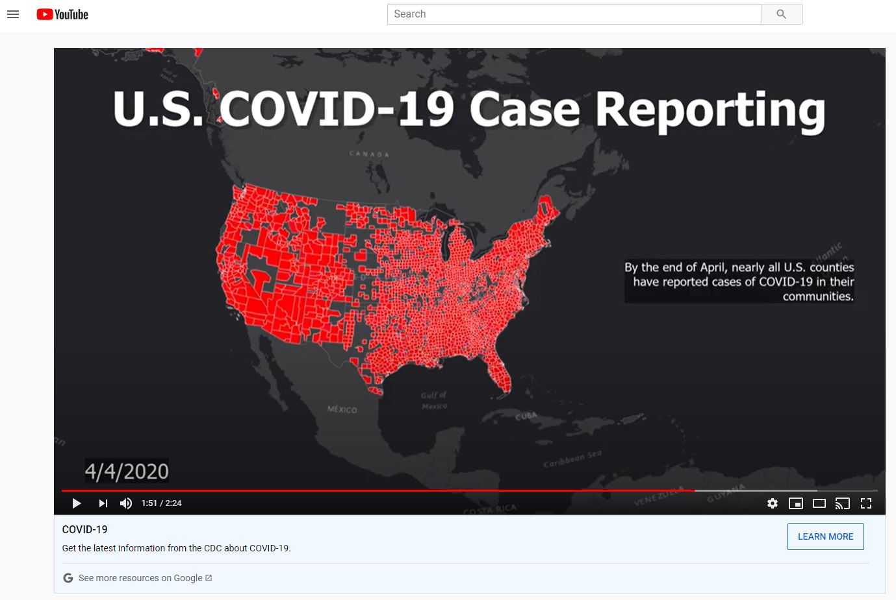

# COVID-19 Time Lapse Visualization Project
Heinz College of Information Systems and Public Policy

Advanced GIS (90-753-A4) Spring 2020

Authors: Sean Cuff (MSPPM 2020) and Christopher Ibeling (MSPPM 2020)

[Project and Data Repository](https://drive.google.com/open?id=1_KvSX6kAjWgqh6ilRnOuHoOHrsHRfNT9)

## Project Overview
When reading about or watching video content about the current pandemic, the maps that most Americans see often provide totals to date of confirmed cases or the number of deaths. What is not as frequently captured in these maps, however, is the factor of time in the outbreak. Certainly, one of the most alarming characteristics of the Coronavirus outbreak is the speed at which it has spread, and a sense of that speed can be lost when viewing a static map on a consistent basis. After all, it is in the public interest to convey the most up-to-date information on the crisis as possible, in order to avoid confusion, misinterpretation, and misinformation.

With this project, we want to demonstrate how quickly COVID-19 had moved across the country by producing a time-lapse map showing the spread of confirmed cases. The time series begins with the first known case in We also wanted to provide the sense of how Coronavirus spread to the communities of the viewer and will develop this map at the county level. The time lapse will begin on January 21, 2020 when the first confirmed case in the United States was reported. It will then walk through each following day, highlighting the counties that reported one or more confirmed cases of Coronavirus. The full rotation of the map’s loop should capture what an outbreak’s exponential rate of infection looks like visually.

### Project Goals
-  Effectively impress upon the audience the speed at which Coronavirus had spread through communities across the country using a time-lapse map of confirmed cases. 
-  Visually demonstrate the proximity of these issues to the audience by developing a map at the county level.
-  Establish a compelling case for continued stay at home orders in the wake of ideologically motivated public protests.

## COVID-19 Spread in the United States
The first confirmed case of COVID-19 in the United States first emerged in Snohomish County Washington on January 21, 2020. Slowly over the following couple of weeks, the virus began to emerge in seemingly disparate parts of the country, namely Cook County, IL, Orange County, CA, and Maricopa County, AZ. Through February, however, confirmed cases of Coronavirus appeared to be growing at a relatively controlled rate and predominantly confined to certain pockets of the country. February’s numbers also coincided with most local health systems efforts to increase their testing capabilities. Many health officials have pointed out that the paucity of testing kits and resources concealed the full extent of the virus’ spread and severity throughout the United States. At the beginning of February, there were a total of 7 confirmed cases in the entire county. By the end of the month, that number had only increased to 66 total cases. 

The second week of March, however, certainly marked a turning point in the United States’ experience of handling the Coronavirus outbreak. As more cases resulted in hospitalizations and testing capabilities increased, the number of counties reporting confirmed cases of COVID-19 jumped substantially. On March 6th, there were a total of 226 confirmed cases across the country. Within the subsequent 48 hours, that number had nearly doubled to 425 total cases of Coronavirus. By the end of the day on March 11th, the total number of cases had surpassed 1,000.  By the end of the second week of March, the government response to the spread of Coronavirus, both locally and federally, had taken on a strikingly different tone. The White House declared a national emergency. By the time the first statewide stay at home order was issued in California on March 19th, the number of total cases had soared to 8,286 cases and the virus was confirmed present in every state. 

The experience of the COVID-19 outbreak through March and April was one of exponential growth. Even with the limited testing abilities of most counties across the United States, the reported number of total cases jumped significantly on a daily basis. On several days it doubled. By April 24th, the outbreak of COVID-19 had reached just about every county throughout the United States.

## Visualizing the Spread of COVID-19
We developed the time-series maps for this project by using two different approaches: ArcGIS Layout to GIF and ArcGIS Animation. We ultimately turned to these methods as developing a time-lapse map with such a large number of polygons presented several logistical challenges. Particularly throughout April when most counties across the country were reporting cases of COVID-19, the ArcGIS Pro and Online software struggled at smoothly rendering each day’s map. The two approaches, then, allowed us to draw on the maps developed in ArcGIS Pro and share a time-series product that loops and renders smoothly.

### ArcGIS Layout to GIF
This approach emerged by examining the html code of a couple of health department websites who were sharing time-lapse COVID-19 maps of their own. Since time-series maps are essentially stop-motion style videos, we decided to take advantage of some of ArcGIS Pro’s layout features to develop our COVID-19 time-lapse GIF. Using a layout of the map, we included a line chart of the total number of cases to provide a sense of the intensity of the spread along with the visual of its geographical spread. The layout format allowed us to step through each day of the slider and export the layout at a jpeg which ultimately formed the COVID-19 GIF.

The most attractive feature of the GIF approach for our project was the ability to add any number of additional information or features to the frame without concern for the video’s smoothness or rendering speed. ArcGIS Pro’s default time slider player particularly struggled at displaying the time-lapse map along with any type of chart. The GIF approach allowed us to develop a very time series with smooth transitions and good additional information.

The downside of this approach is that it is certainly time intensive. Each step of the time-series needs to be an individual image. Any mistake on the layout then is unfortunately not easily corrected.

### ArcGIS Animation to MP4 HD1080 Video
An alternative method for creating this visualization emerged within the ArcGIS Pro software. The software contains an animation function where you can import a time series map, edit as a video, and export as a high resolution MP4 file. The process is pretty intuitive, with few technical difficulties arising despite my inexperience in video editing. The video, with overlaid content and charts, can be view on YouTube at the link below.

The strength of this approach is the versatility of the editing tool and the ability to overlay interstitial content on the map. This provided the opportunity to tell more of the story than a static map or standalone GIF, both of which require some additional context to inform the audience. The downside to this method is that it does require video editing experience to make a truly polished product, and the time it takes the software to package and export the file. There are likely far greater capabilities with the animation tool, like cutting to the dynamic line graph shown in the GIF, that are simply beyond my skills. However, it was an interesting use of software functionality that often go unused in the academic setting.

## Data Processing
Getting to the point of even having a functional feature layer from the raw COVID-19 case data presented several interesting obstacles to overcome. We drew on the New York Times’ publicly available COVID-19 dataset for the number of daily reported cases by county. Unfortunately for the purposes of joining that data to a shapefile, the Times’ dataset grouped all counties together in New York City and Kansas City without a corresponding FIPS code. It additionally dropped the leading 0 for all counties with a 4-digit FIPS code. 
To resolve the issue, we very fortunately found a shared [python script](https://drive.google.com/open?id=1-7Q3j0hzHa-4mDcb1Wxyl6-wzF7et7lI) that inserted the leading zero for any 4-digit FIPS code and assigned entries for New York City and Kansas City with a made up FIPS code. We then took a generalized U.S. counties layer with dissolved counties within Kansas City and New York City and joined it with the fixed New York Times dataset. We have shared the joined counties shapefile both on ArcGIS online as well as through a [shared google drive folder](https://drive.google.com/open?id=1_KvSX6kAjWgqh6ilRnOuHoOHrsHRfNT9) for users to implement in their own projects.

## Lessons Learned and Project Takeaways
### Exponential Growth
One of the most striking features of the COVID-19 outbreak that the time-lapse maps captured was the impact of exponential growth within a pandemic. A static map can communicate the magnitude of the spread at any given moment, but it can be difficult to project what that number could be in the future. Even though we have seen the daily case totals countless times, it was alarming nonetheless to see the large jumps in total confirmed cases with each step of the time-lapse map and how quickly that translated to geographical spread.

### Design Tradeoffs
One of the challenges we faced was choosing, from a design and product perspective, what extent to display the map. The COVID-19 crisis is affecting every state, county, and community in the country. Like many maps, we chose to make the unfortunate tradeoff in only including the contiguous United States in the extent. This allowed for greater granualarity in the counties within the extent. This map does not visualize the intensity of cases and impacts across counties. However, it should be stated that the economic and health impacts of this crisis on Hawaii and Alaska have been devastating, particularly in industries related to tourism. This design decision was difficult to make, but ultimately was the best way to fulfill the goals of our visualization.
